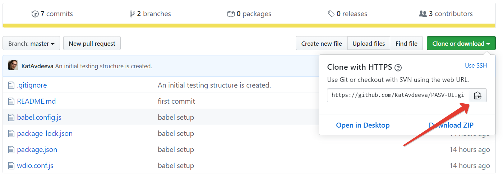

### Content 
* [x] PASV-UI Project Installation From The Scratch
* [x] PASV-UI Project Installation Instruction For Current Collaborators

#### PASV-UI Project Installation From The Scratch 
1 Go to https://github.com/ and create a new repository called 'PASV-UI'.

2 Add collaborators. 

3 Go to 'Clone or download' tab. Clone the project link.

4 Go to WebStorm dashboard and click 'Get from Version Control.'

5 Paste the copied link into URL text field. Click 'Clone.'

6 Create '.gitignore' file with the following text: 
````
.idea
.idea/*
node_modules/
````
7 Commit and push the '.gitignore' file to the created repository. 

8 Type the following command in the terminal to install WDIO : 
```
npm i --save-dev @wdio/cli
``` 
9 Type the following command in the terminal to generate a configuration file to store WebdriverIO settings: 
```
./node_modules/.bin/wdio config -y
```
10 Open 'package.json' file and type the following test script: 
````
"scripts": {
    "test": "./node_modules/.bin/wdio wdio.conf.js"
  },
````
11 Type the following command in the terminal to install chai: 
````
npm install chai
````
12 Type the following command in the terminal to install 'Babel': 


#### PASV-UI Project Installation Instruction For Current Collaborators 

1 Go to https://github.com/KatAvdeeva/PASV-UI.

2 Clone the project GitHub link. 


3 Go to WebStorm dashboard. Click 'Get from Version Control.'

4 Place the copied link into URL text field. Click 'Clone'.

5 Open the terminal and type the following command: 
````
nmp install
````
 

#### Useful Resources
* GitHub: https://github.com/
* WedDiverIO: https://webdriver.io/docs/gettingstarted.html

